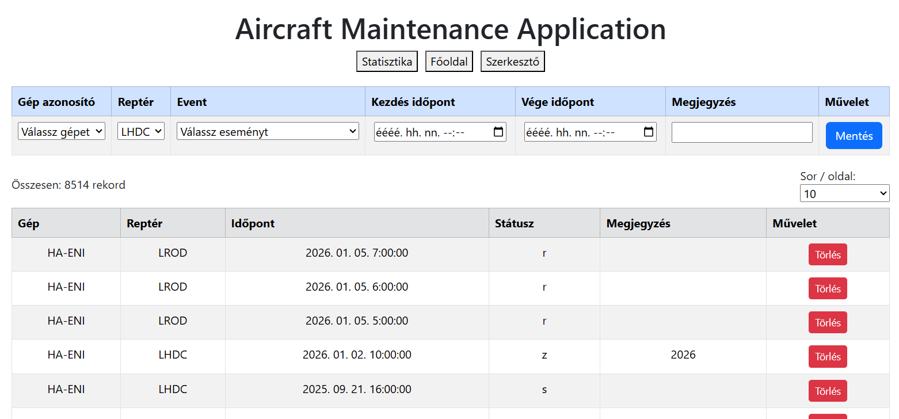
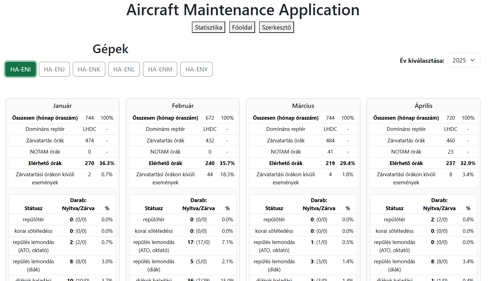
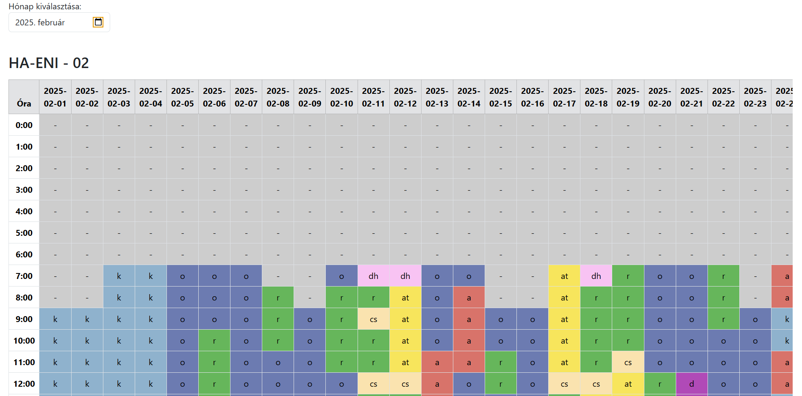
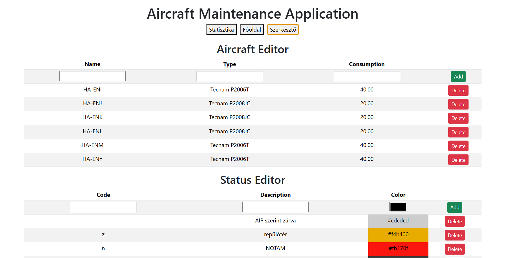

# Aircraft Maintenance Application - React + Vite + Electron Project

Ez a projekt egy asztali alkalmazás, amely **React**, **Vite**, **Electron**, **Better SQLite3**, **Bootstrap** és **xlsx** könyvtárakat használ. A cél egy gépek ütemezését és statisztikáit kezelő alkalmazás létrehozása.

---

## Kezdés

### 1. Klónozd a projektet

```bash
git clone <repository_url>
cd <project_folder>
```

## Telepítsd a függőségeket

### Vite és React plugin

```bash
npm install vite @vitejs/plugin-react --save-dev
```

### Electron

-fő js library, ami megengedi, hogy a későbbiekben asztali alkalmazássá buildeljük a projektet

```bash
npm install electron
```

### Párhuzamos futtatáshoz

```bash
npm install -D concurrently wait-on
```

#### Adatbázis kezeléshez (helyi gépen)

```bash
npm install better-sqlite3
```

### későbbiekben

```bash
npm install mariadb
```

### Bootstrap stílusokhoz

```bash
npm install bootstrap
```

majd a main.jsx fájlban, hogy használni is tudjuk majd a stílushoz:

```bash
import 'bootstrap/dist/css/bootstrap.min.css';
```

### Loginhoz

```bash
npm install react-router-dom
```

valamint a jelszóvédelemhez

```bash
npm install argon2
```

### Ellenőrzés

A package.json-ban legyen benne:

```bash
{
  "scripts": {
    "start": "electron .",
    "dev": "concurrently \"npm run dev:react\" \"npm run dev:electron\"",
    "build": "electron-builder"
  }
}
```

## A fejlesztői mód futtatás: React + Electron egyszerre

```bash
npm run dev
```

### Build készítése electron-builddel

```bash
npm run build
```

### kész build futtatása

```bash
npm run start
```

## Főoldal - Input.jsx



Lehetővé teszi hogy kiválasszuk a gépeket, repteret, eventstátuszt, kezdő vég időpontot és opcionális megjegyzést
A kezdőidőpont beírása után automatikusan kitölti a végidőpontot kezdés +1 órával
Egyszerre nagyobb intervallumban is be lehet illeszteni eseményeket, ha nyitvatartási időn kívülre esik, felugró ablak jelenik meg, hogy biztonsan be akarjuk e szúrni az eseményt. Ugyanez történik hogyha már létező esemény idejére akarunk beilleszteni egy másikat.

## Statisztika - Fullreview.jsx és Statistics.jsx



Hónapos naptárkalendárium megjelenítés - hoverrel kiirja a jelentést is



## Szerkesztő felület - Editor.jsx

Hozzá lehet adni plusz eseményt/gépet/usert, a táblázat azzonnal frissül



### Adatbázis -> mariadb  létrehozás

```sql
CREATE TABLE aircrafts (
    id INT AUTO_INCREMENT PRIMARY KEY,
    name VARCHAR(100) NOT NULL,
    type VARCHAR(100),
    fogyasztas DECIMAL(10,2)
);

CREATE TABLE airports (
    id INT AUTO_INCREMENT PRIMARY KEY,
    repter VARCHAR(200),
    repter_id VARCHAR(10) NOT NULL,
    nyitvatartas VARCHAR(255)
);

CREATE TABLE statuses (
    id INT AUTO_INCREMENT PRIMARY KEY,
    jelkod VARCHAR(20) NOT NULL,
    jelentes VARCHAR(255),
    color VARCHAR(20)
);

CREATE TABLE users (
    id INT AUTO_INCREMENT PRIMARY KEY,
    username VARCHAR(100) NOT NULL UNIQUE,
    password_hash VARCHAR(255) NOT NULL,
    role VARCHAR(50)
);

CREATE TABLE if not exists schedules (
    event_id VARCHAR(255) PRIMARY KEY,
    airport_id INT,
    aircraft_id INT NOT NULL,
    status_id int not null,
    event_timestamp DATETIME NOT NULL,
    note VARCHAR(255),
    created TIMESTAMP,
    CONSTRAINT fk_airport
        FOREIGN KEY (airport_id) REFERENCES airports(id)
        ON DELETE CASCADE
        ON UPDATE CASCADE,
    CONSTRAINT fk_aircraft
        FOREIGN KEY (aircraft_id) REFERENCES aircrafts(id)
        ON DELETE CASCADE
        ON UPDATE CASCADE,
        CONSTRAINT fk_staus
    FOREIGN KEY (status_id) REFERENCES statuses(id)
        ON DELETE CASCADE
        ON UPDATE CASCADE
);
```

#### jelenlegi adatbázisból dump.sql -t készítünk (első lefuttatásnál az electron_main.js-be be lehet illeszeni aztán törölni)

```js
const tables = ["aircrafts", "airports", "statuses", "users", "schedules"];
let dump = "";

// minden táblát végigmegyünk
tables.forEach(table => {
  const rows = db.prepare(`SELECT * FROM ${table}`).all();
  rows.forEach(row => {
    const keys = Object.keys(row).join(", ");
    const values = Object.values(row)
      .map(v => v === null ? "NULL" : `'${String(v).replace(/'/g, "''")}'`)
      .join(", ");
    dump += `INSERT INTO ${table} (${keys}) VALUES (${values});\n`;
  });
});

fs.writeFileSync("dump.sql", dump, "utf8");
console.log("✅ dump.sql létrehozva");
```

Helyi adatbáziskezelőben hozz létre egy aircrafts.db-t és add hozzá a mariadb connenctiont
majd lépj be a helyi mappába pl:

```bash
cd "C:\Program Files\MariaDB 11.8\bin"
```

futtasd a dump importot

```bash
mysql -u root -p aircrafts < "C:\eleresiut\aircraft-maintenance-application\dump.sql"
```
